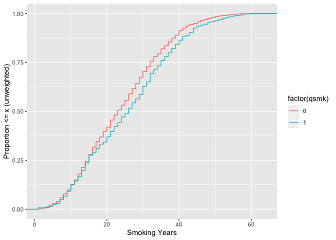

<!-- README.md is generated from README.Rmd. Please edit that file -->

# ggecdf

<!-- badges: start -->
<!-- badges: end -->

The goal of ggecdf is to easily create weighted and unweighted empirical
cumulative distributions (ECDFs) in ggplot2

## Installation

You can install the development version of ggecdf from
[GitHub](https://github.com/) with:

``` r
# install.packages("devtools")
devtools::install_github("malcolmbarrett/ggecdf")
```

## Example

``` r
library(ggecdf)
library(ggplot2)
# dataset with weights
nhefs_weights <- tidysmd::nhefs_weights

ggplot(
  nhefs_weights,
  aes(x = smokeyrs, color = factor(qsmk), group = factor(qsmk))
) +
  geom_ecdf() +
  xlab("Smoking Years") +
  ylab("Proportion <= x (unweighted)")
```



``` r

ggplot(
  nhefs_weights,
  aes(x = smokeyrs, color = factor(qsmk), group = factor(qsmk))
) +
  geom_ecdf(aes(weight = w_ato)) +
  xlab("Smoking Years") +
  ylab("Proportion <= x (weighted)")
```


