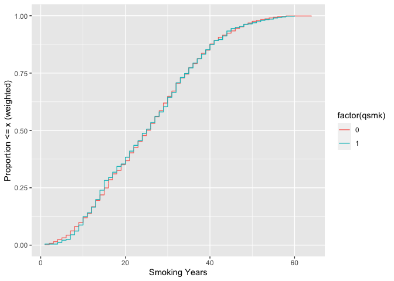

<!-- README.md is generated from README.Rmd. Please edit that file -->

# ggecdf

<!-- badges: start -->

[](https://github.com/malcolmbarrett/ggecdf/actions)
<!-- badges: end -->

The goal of ggecdf is to easily create weighted and unweighted empirical
cumulative distributions (ECDFs) in ggplot2

## Installation

You can install the development version of ggecdf from
[GitHub](https://github.com/) with:

``` r
# install.packages("devtools")
devtools::install_github("malcolmbarrett/ggecdf")
```

## Example

`geom_ecdf()` allows you to create ECDFs based on ggplot’s `stat_ecdf()`

``` r
library(ggecdf)
library(ggplot2)
# dataset with weights
nhefs_weights <- tidysmd::nhefs_weights

ggplot(
  nhefs_weights,
  aes(x = smokeyrs, color = factor(qsmk))
) +
  geom_ecdf() +
  xlab("Smoking Years") +
  ylab("Proportion <= x (unweighted)")
```


Additionally, `geom_ecdf()` supports a `weights` aesthetic to calculate
weighted ECDFs. For instance, here’s the same variables weighted by an
ATO weight:

``` r
ggplot(
  nhefs_weights,
  aes(x = smokeyrs, color = factor(qsmk))
) +
  geom_ecdf(aes(weights = w_ato)) +
  xlab("Smoking Years") +
  ylab("Proportion <= x (weighted)")
```


